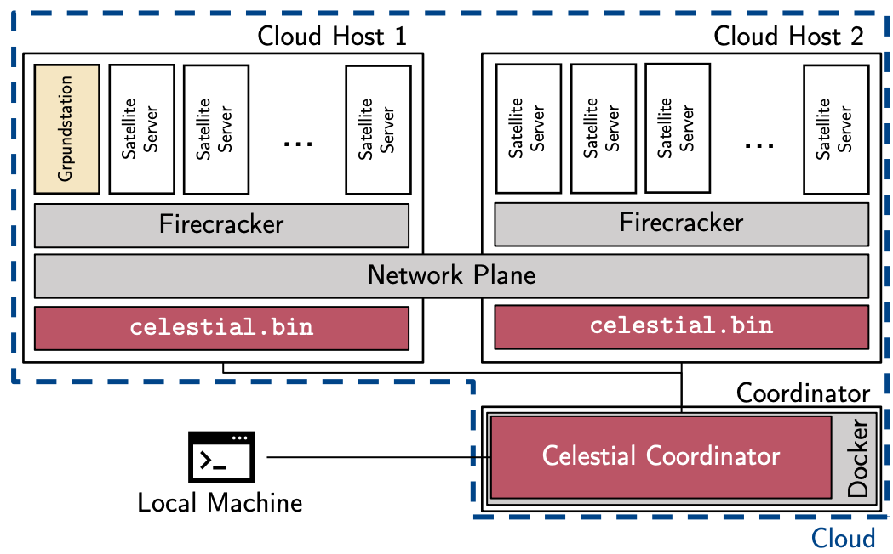

# Evaluating LEO Edge Software in the Cloud with Celestial

This repository contains instructions for our demonstration of [Celestial](https://github.com/OpenFogStack/celestial) at the 11th IEEE International Conference on Cloud Engineering (September 25-28, 2023, Boston, MA, USA).
This demo is mainly adapted from the [Celestial quick start instructions](https://openfogstack.github.io/celestial/quickstart.html).
For the full Celestial source code, please check out [the main repository](https://github.com/OpenFogStack/celestial).

[](https://youtu.be/nBC7RGeE_qM)

## Research

If you use this software in a publication, please cite it as:

### Text

T. Pfandzelter and D. Bermbach, **Evaluating LEO Edge Software in the Cloud with Celestial**, Proceedings of the 11th IEEE International Conference on Cloud Engineering (IC2E '23, Demos), Boston, MA, USA, 2023.

### BibTeX

```bibtex
@inproceedings{pfandzelter2023celestialdemo,
    author = "Pfandzelter, Tobias and Bermbach, David",
    title = "Evaluating LEO Edge Software in the Cloud with Celestial",
    booktitle = "Proceedings of the 11th IEEE International Conference on Cloud Engineering",
    month = sep,
    year = 2023,
    publisher = "IEEE",
    address = "New York, NY, USA",
    series = "IC2E 2023",
    location = "Boston, MA, USA",
}
```

A full list of our [publications](https://www.tu.berlin/en/mcc/research/publications/) and [prototypes](https://www.tu.berlin/en/mcc/research/prototypes/) is available on our group website.

## License

Like Celestial itself, the code in this repository is licensed under the terms of the [GPLv3](./LICENSE) license.

## Outline

1. [Prerequisites](#prerequisites)
1. [Building a configuration](#building-a-configuration)
1. [Setting up infrastructure](#setting-up-infrastructure)
1. [Setting up Celestial](#setting-up-celestial)
1. [Running a test](#running-a-test)
1. [Analyzing your results](#analyzing-your-results)

## Prerequisites



Celestial runs on distributed infrastructure, namely at least one host (which runs your microVMs) and a coordinator (which runs the simulation environment).
Subsequently, you will need the following things:

- some UNIX machine (macOS or Linux) to run your coordinator
- a Linux machine with a recent operating system that supports virtualization

The coordinator can be a headless cloud machines, a VM, or your local computer.
For advanced usage, a bidirectional network connection between host and coordinator is required.
If you would like to visualize your satellite network, you will need a desktop environment.

The host machine can be a VM or a cloud machine -- in the cloud, be sure to set up nested virtualization properly, e.g., by using a `metal` machine type on AWS or adding the `nested virtualization` license to your machine on Google Compute Platform.

For this tutorial, the following dependencies are required (on your local machine):

- Python 3.9 with PIP (dependencies do not allow us anything other than 3.10)
- `terraform`
- the `gcloud` CLI
- Docker
- `git`

You will also need a Google Cloud Platform account, as we will run our host there.
Make sure to set the right Google Cloud project ID in `variables.tf`.

For now, download the `v0.1.2` version of Celestial and unpack it locally:

```sh
curl -fLsS https://github.com/OpenFogStack/celestial/archive/refs/tags/v0.1.2.zip --output celestial-0.1.2.zip
unzip celestial-0.1.2.zip
# for convenience, just name it celestial
mv celestial-0.1.2 celestial
```

## Building a Configuration

Before we can start our emulated testbed, we will need to configure what we would like to run on it.

### Selecting an Application

For our application, we are building a simple Python script that pings different satellite servers from a ground station in, let's say, Boston.
Our implementation of this script is in `ping.py`.
Note that we use the `ping3` Python library, which we will need to install on our ground station server.
As our satellite servers simply answer this ping, there is no need to install anything specific on there.

### Building the Application

We can now put together our application into an image file for our ground station server.
For that, we need four things: an operating system distribution (we use [Alpine Linux](https://www.alpinelinux.org/) for this), instructions to execute to create the base image, instructions to execute when the node starts, and of course we need our files.

Our base installation (`ping-base.sh`) installs Python (to run our script) the `ping3` package.
This only happens once when we create the image -- when we actually start our server, these dependencies will be available.

Our script to run the ground station ping service (`ping.sh`) configures the name server (as Celestial provides DNS services to identify other satellites) and runs our Python script.

To put everything together, we provide a script that runs in Docker:

```sh
# move into the builder directory
pushd ./celestial/builder
# create the rootfs builder image
docker build --platform=linux/amd64 \
    -t rootfsbuilder:local .

# move back into this directory
popd

# now we can build the ping image
docker run --rm --platform=linux/amd64 \
    -v "$(pwd)/ping.py":/files/ping.py \
    -v "$(pwd)/ping.sh":/app.sh \
    -v "$(pwd)/ping-base.sh":/base.sh \
    -v "$(pwd)":/opt/code \
    --privileged rootfsbuilder:local ping.img
```

And out we get a `ping.img` root file system!

Note that we also must create a server file system (with the much less exciting `server.sh`, which just does nothing):

```sh
docker run --rm --platform=linux/amd64 \
    -v "$(pwd)/server.sh":/app.sh \
    -v "$(pwd)":/opt/code \
    --privileged rootfsbuilder:local server.img
```

### Configuring a Satellite Network

There are competing satellite network designs, such as the SpaceX Starlink network, Amazon Kuiper network, or the OneWeb constellation.
For our purposes, we will use the design of the polar orbit Iridium constellation.
Our network will have 6 orbital planes with 11 satellites each, at an altitude of 781km and inclination of 86.4 degrees.

### Putting it Together

The main configuration file we need will be called `ping.toml`, and it contains all necessary information for Celestial:
constellation parameters, parameters for our machines, ground station location, root file systems to use, and more.

You will find different sections in the file, for example the configuration of the satellite orbital model to use:

```toml
model = "SGP4"
```

Similarly, we need to configure the satellite constellation:

```toml
[[shell]]
planes = 6
sats = 11
altitude = 780
inclination = 90.0
arcofascendingnodes = 180.0
eccentricity = 0.0
```

And we need to set up our ground station in Boston:

```toml
[[groundstation]]
name = "boston"
lat = 42.350183
long = -71.097765

[groundstation.computeparams]
vcpu_count = 4
mem_size_mib = 4096
disk_size_mib = 100
rootfs = "ping.img"
```

## Setting up Infrastructure

We can now configure our infrastructure.
In this demo, we will run a `n2-standard-8` cloud machine on Google Cloud in the `northamerica-northeast` (Montreal) region as our host.
Our coordinator will run on the local machine.
Note that this is not the recommended way to run Celestial: it is a good idea to have your coordinator also run as a server in the same data center.
However, running on the local machine allows us to view the animation.

### Setting up the Coordinator

On our local machine, we will run everything in a Python virtual environment:

```sh
# create the virtual environment
python3.9 -m venv .venv
# activate the virtual environment
source .venv/bin/activate
# install the dependencies
# note that the dependencies are locked at specific versions for Python 3.9
# for newer Python versions, you may need to update these dependencies
python3 -m pip install -r requirements.txt
```

With these dependencies, you can already see the animation:

```sh
python3 celestial/animate.py ping.toml
```

### Setting up the Host

Using terraform, we can create our cloud VM:

```sh
# initialize terraform
terraform init
# plan out our infrastructure configuration
# see if everything is as expected
terraform plan
# apply our infrastructure configuration
# enter 'yes' when prompted
terraform apply
```

After a short while, our cloud VM is ready!
Note the public IP address of that host and put it into your `ping.toml` configuration file.
Access the VM over SSH:

```sh
# configure the SSH connection
gcloud config set project YOUR_PROJECT_ID
gcloud compute config-ssh
```

The last command will show you your available instances.
For example, you can now access the instance in project `PROJECT_ID` using:

```sh
ssh celestial-host.northamerica-northeast1-c.PROJECT_ID
```

## Setting up Celestial

We can now compile Celestial.
The recommended way to do this is to use Docker, which lets us skip installing Go and its dependencies:

```sh
# move into the celestial directory
pushd celestial
# create the builder image
docker build --platform=linux/amd64 \
    -f compile.Dockerfile -t celestial-make:local .

# compile our proto/grpc files
docker run --rm --platform=linux/amd64 \
    -v $(pwd):/celestial celestial-make:local proto/

# compile the binary
docker run --rm --platform=linux/amd64 \
    -v $(pwd):/celestial celestial-make:local celestial.bin

# move back into this directory
popd
```

Finally, we of course need to copy all of our files to the host using `scp`.
Again, make sure to replace `YOUR_PROJECT_ID` with your Google Cloud project.

```sh
PROJECT=YOUR_PROJECT_ID

# copy celestial and our images to the host
scp celestial/celestial.bin celestial-host.northamerica-northeast1-c.$PROJECT:.
scp ping.img celestial-host.northamerica-northeast1-c.$PROJECT:.
scp server.img celestial-host.northamerica-northeast1-c.$PROJECT:.
scp start-celestial.sh celestial-host.northamerica-northeast1-c.$PROJECT:.

# and we need to reboot the host one last time
ssh celestial-host.northamerica-northeast1-c.$PROJECT sudo reboot now
```

## Running a Test

Finally, we can run our experiment!

### Starting Celestial

Start Celestial on your host:

```sh
ssh celestial-host.northamerica-northeast1-c.$PROJECT ./start-celestial.sh
```

And in another window, start the coordinator:

```sh
python3 ./celestial/celestial.py ping.toml
```

We now just need to wait for a few minutes to get some results!
You can also follow along with the output of your ping host by tailing stdout logs:

```sh
ssh celestial-host.northamerica-northeast1-c.$PROJECT tail -f /celestial/out/out-boston
```

### Visualizing Live Results

Our `check.py` takes input from `stdin` and updates a live graph.
In order to get the input, we simply tail the ground station output and pipe it into our script:

```sh
ssh celestial-host.northamerica-northeast1-c.$PROJECT tail -f /celestial/out/out-boston | ./check.py
```

### Stopping Celestial

To stop Celestial, issue a `Ctrl+C` to host and coordinator.

Don't forget to stop your instances!

```sh
terraform destroy -auto-approve
```
